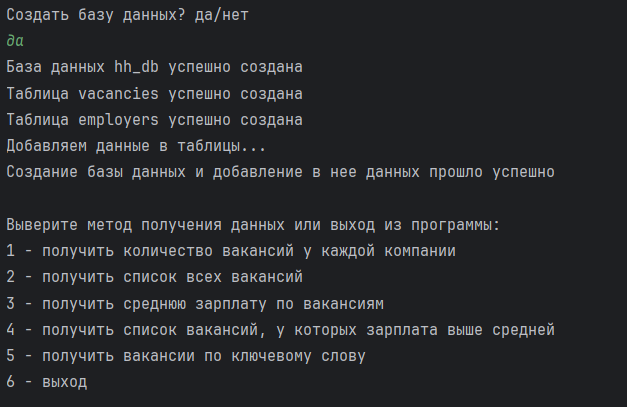

# Приложение для поиска вакансий (HeadHunter.ru)

Консольное приложение для работы с базой данных, наполненной данными о вакансиях
и работодателях с сервиса HeadHunter.ru.

## Содержание
- Установка
- Использование
- Пример работы
- Структура
- Документация и ссылки

## Установка
Клонирование репозитория на локальный репозиторий:
1. Чтобы клонировать репозиторий с GitHub себе на компьютер, необходимо
получить ссылку на доступ к репозиторию в разделе **Code** на странице
репозитория, выбрать способ взаимодействия с GitHub (**HTTPS**) и **скопировать**
ссылку на репозиторий для клонирования.
2. В главном меню **PyCharm** перейдите в меню **Get from VCS**. 
3. Вставьте ссылку на репозиторий и нажмите на кнопку **Clone**.
4. По окончании клонирования будет открыт проект, вы можете работать с этим проектом.

## Использование
Для начала работы с консольным приложением необходимо создать файл database.ini с
параметрами подключения к базе данных, затем запустить модуль main.py в 
корневой папке проекта.

После запуска программа запросит разрешение на создание базы данных, необходимых
таблиц, а также заполнения этих таблиц данными с сайта hh.ru. Для заполнения таблиц 
базы данных потребуется подключение к сети Интернет.

После этого программа предложит меню для выбора метода получения данных.
Данные выводятся в консоль в удобном читаемом
формате, а также содержат ссылки, которые легко скопировать и изучить текущую
вакансию и работодателя на сайте hh.ru.

## Пример работы приложения

## Структура
- **main.py** - модуль, реализующий основную логику проекта и взаимодействие
с пользователем, связывает функциональности проекта.
- **config.py** - модуль с путями к основным папкам и директориям, а также
функцией для получения параметров подключения из файла database.ini
- **external_api.py** - модуль с абстактными классами по работе с API.
- **api_hh.py** - модуль с классом работы с API hh.ru
- **utils.py** - модуль с дополнительными функциями
- **database_manager.py** - модуль для работы с базой данных

## Документация и ссылки
Документация hh.ru: https://api.hh.ru/openapi/redoc